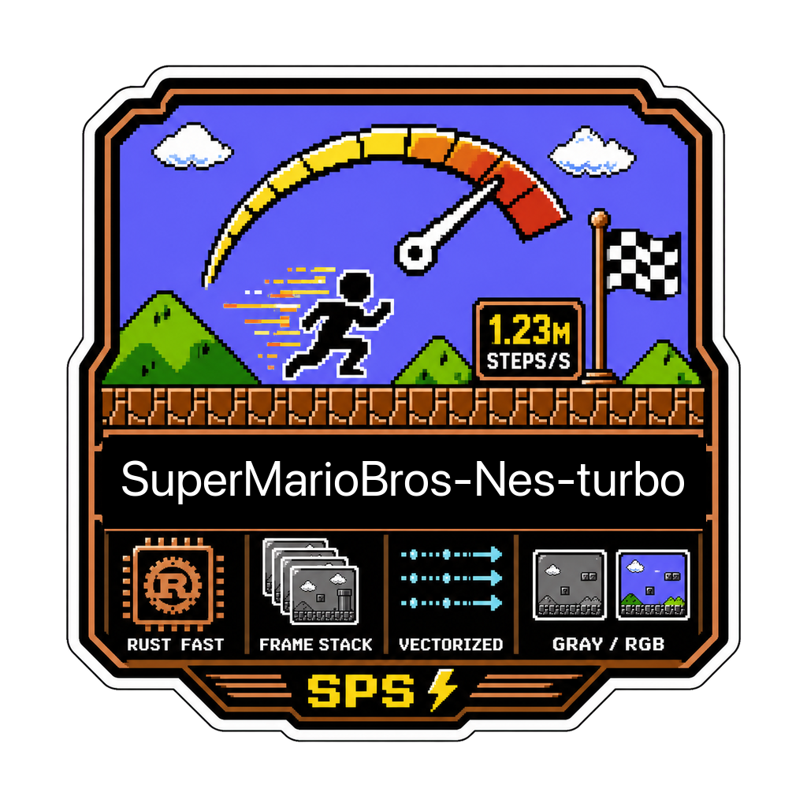
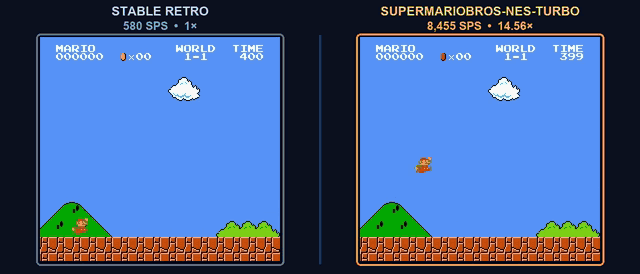
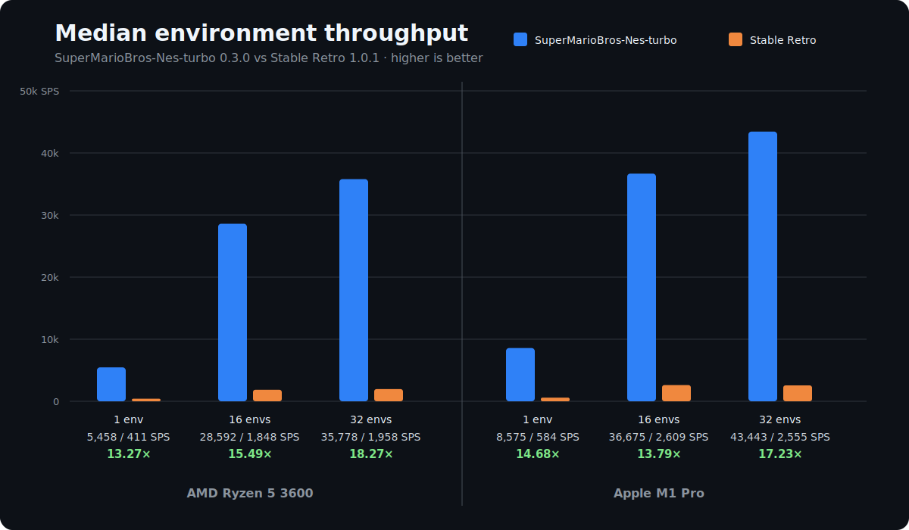
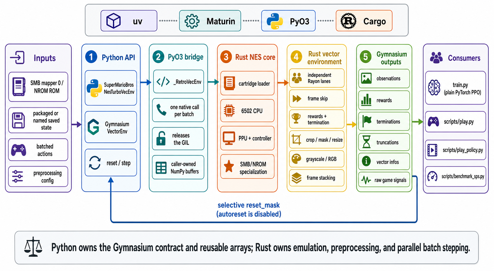

<div align="center">
  

  **🚀 Blazing fast SuperMarioBros-Nes environment for Reinforcement Learning 🍄**
</div>

<div align="center">
  
</div>

**SuperMarioBros-Nes-turbo** is a Rust-backed Gymnasium vector environment for
reinforcement-learning researchers working with Super Mario Bros NES. In the
published `0.3.0` mapper 0/NROM benchmark, it measured **13.27× to 18.27×** the
end-to-end step and preprocessing throughput of
[Stable Retro](https://github.com/Farama-Foundation/stable-retro), depending on
the host and number of environments.

## ⚡ Why it is fast

- **Focused scope.** It specializes in the canonical Super Mario Bros mapper
  0/NROM workload.
- **Native vector engine.** One Rust engine owns all lanes, releases the GIL,
  and parallelizes batches of four or more environments with Rayon.
- **One efficient call.** Actions, emulation, preprocessing, frame stacks,
  rewards, termination, and infos share reused buffers across one
  Python-to-Rust call.
- **Optimized rendering.** Guarded game-routine fast paths, event-bounded PPU
  stepping, and direct grayscale rendering avoid unnecessary interpreter and
  image work.

*Unsupported fast-path cases fall back to the instruction interpreter.*

## 📦 Install

Install the prebuilt package from PyPI:

```bash
python -m pip install supermariobrosnes-turbo
```

Prebuilt wheels support Python `>=3.9` on macOS, Linux, and Windows without a
Rust toolchain. See [CONTRIBUTING.md](CONTRIBUTING.md) for the source checkout
and development setup.

**ROM setup:** ROM files are not included. Set `RETRO_DATA_PATH` to a
user-writable data directory, then import the supported ROM from a file,
directory, or ZIP archive.

On macOS or Linux:

```bash
export RETRO_DATA_PATH="${XDG_DATA_HOME:-$HOME/.local/share}/retro"
smb-turbo import /path/to/roms
```

On Windows PowerShell:

```powershell
$env:RETRO_DATA_PATH = "$env:LOCALAPPDATA\retro"
smb-turbo import C:\path\to\roms
```

The importer writes
`<RETRO_DATA_PATH>/stable/SuperMarioBros-Nes-v0/rom.nes`. If the variable is
unset, it uses the equivalent data tree inside the installed package instead.
`rom_path=` and the CLI's `--rom` remain available as overrides. The canonical
ROM SHA-256 is:

```text
f61548fdf1670cffefcc4f0b7bdcdd9eaba0c226e3b74f8666071496988248de
```

## 🎮 Use

```python
import numpy as np

from supermariobrosnes_turbo import (
    Actions,
    SuperMarioBrosNesTurboVecEnv,
    action_batch,
)

env = SuperMarioBrosNesTurboVecEnv(
    "SuperMarioBros-Nes-v0",
    state="Level1-1",
    num_envs=16,
    use_restricted_actions=Actions.ALL,
    frame_skip=4,
    obs_grayscale=True,
    obs_crop=(32, 0, 0, 0),
    obs_resize=(84, 84),
    obs_layout="chw",
    frame_stack=4,
)

observations, infos = env.reset(seed=123)
observations, rewards, terminated, truncated, infos = env.step(
    action_batch("right", env.num_envs)
)

done = terminated | truncated
if done.any():
    state_indices = np.full(env.num_envs, -1, dtype=np.int32)
    state_indices[done] = 0
    observations, reset_infos = env.reset(
        options={"reset_mask": done.copy(), "state_indices": state_indices},
    )

env.close()
```

**Important:** Autoreset is disabled. Selectively reset terminal lanes before
stepping again.

## 🏁 Train and play

```bash
smb-turbo train Level1-1
smb-turbo play
```

**Training** searches observation-free `(action, duration)` programs with beam
search by default. It stops on the first level completion; pass
`--continue-after-completion` to continue through the transition budget. A new
default beam run replaces the existing canonical run; custom outputs and explicit
JERK runs remain protected unless `--overwrite` is passed. `Level1-1` writes
`runs/Level1-1/Level1-1.zip`; playback uses the matching trained policy when
available and switches policies as levels change. Running `smb-turbo play`
without a state starts from `Level1-1`; pass an exact state identifier to start
elsewhere. Run either command with `--help` for configuration options.

State names are exact identifiers from the configured state catalog. This
includes canonical names such as `Level1-1`, packaged variants such as
`Level2-1-clouds-easy`, and imported names such as `Custom`; shorthand and case
normalization are intentionally unsupported.

In an interactive terminal, both trainers automatically open a full-screen
dashboard with live transition, throughput, search, best-path, and event stats.
Redirected output and CI use the existing plain logs; pass `--ui plain` to
select them explicitly. Press `q` or `Ctrl-C` in the dashboard for a safe stop:
the current vector step finishes, final metrics are written, and the best
policy is saved when a candidate exists.

The checkout-compatible `uv run python train.py Level1-1` and
`uv run python play.py` entry points remain available.

To use JERK instead of the default fixed-width beam while keeping the same
action-run representation, reward, episode boundary, and playback format, run:

```bash
smb-turbo train Level1-1 --algorithm jerk --overwrite
smb-turbo play Level1-1
```

New default runs use `runs/<State>/` regardless of algorithm. For compatibility,
playback still discovers historical algorithm-specific directories, preferring
`runs/<State>-beam/` over `runs/<State>-jerk/`.

## 🧰 Commands

```bash
smb-turbo import /path/to/roms        # import the supported ROM
smb-turbo train Level1-1              # train a state-keyed beam policy
smb-turbo play                        # play Level1-1 manually or with its policy
uv sync --frozen --extra dev --group dev  # install development dependencies
uv run maturin develop --release      # build the optimized Rust extension
make test                             # run Rust and Python tests
make test-retro-oracle                # run ROM-backed parity and policy tests
make benchmark                        # benchmark SuperMarioBros-Nes-turbo locally
make benchmark-report                 # compare SuperMarioBros-Nes-turbo with Stable Retro
```

## 📈 Benchmark

[](BENCHMARKS.md)

The chart records the published `0.3.0` comparison. See
[BENCHMARKS.md](BENCHMARKS.md) for exact results, protocol, and machine details.

## Notes

- **Scope:** This emulator supports only `SuperMarioBros-Nes-v0` on mapper
  0/NROM; it is not a general NES or Stable Retro replacement.
- **States:** Packaged states cover `Level1-1` through `Level8-4`, with
  additional variants. `state=` accepts one name, path, or byte payload;
  `state_catalog=` preloads an ordered selection for explicit per-lane resets.
- **Actions:** `Actions.ALL` and `Actions.FILTERED` accept per-button masks;
  `Actions.DISCRETE` provides Stable Retro-compatible 36-way actions.
- **Playback:** Play commands require a discoverable native SDL2 library and
  open local gameplay windows.
- **Contributing:** See [CONTRIBUTING.md](CONTRIBUTING.md) and follow the
  [Code of Conduct](CODE_OF_CONDUCT.md).
- **Affiliation:** This unofficial research project is not affiliated with or
  endorsed by Nintendo. See [NOTICE.md](NOTICE.md).

## Architecture



## License

Code is licensed under the [MIT License](LICENSE). Third-party names, marks, and
user-supplied content are excluded; see [NOTICE.md](NOTICE.md).
