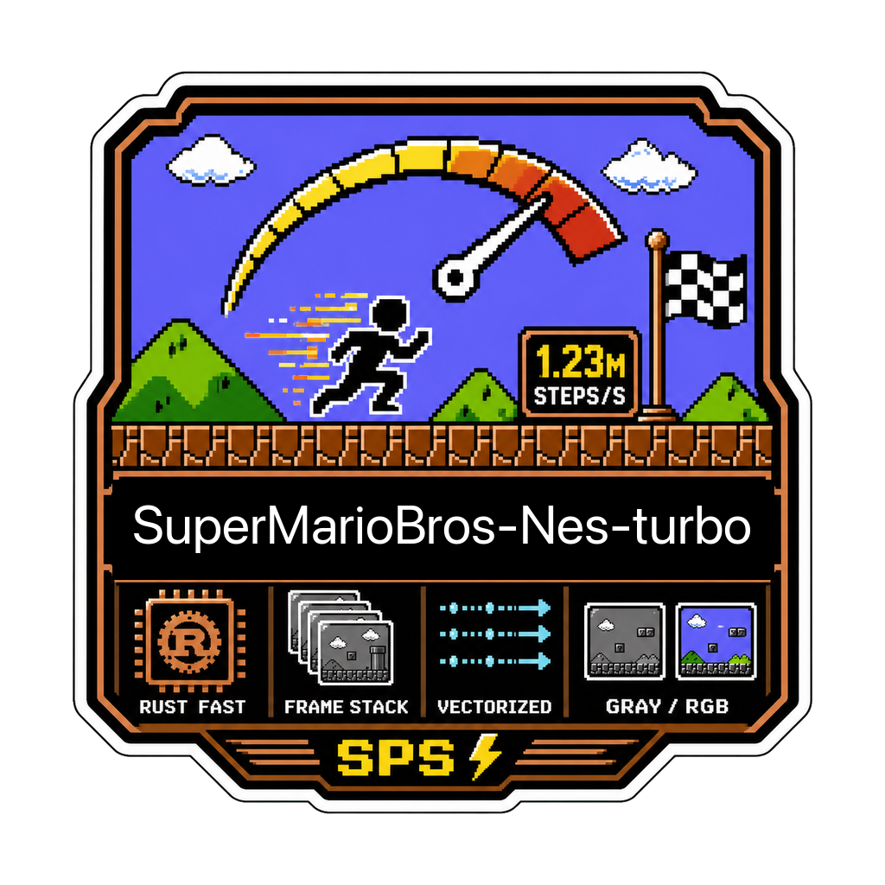
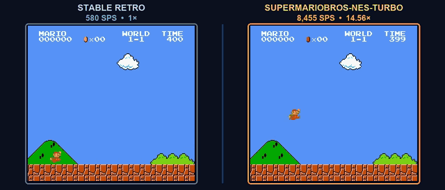
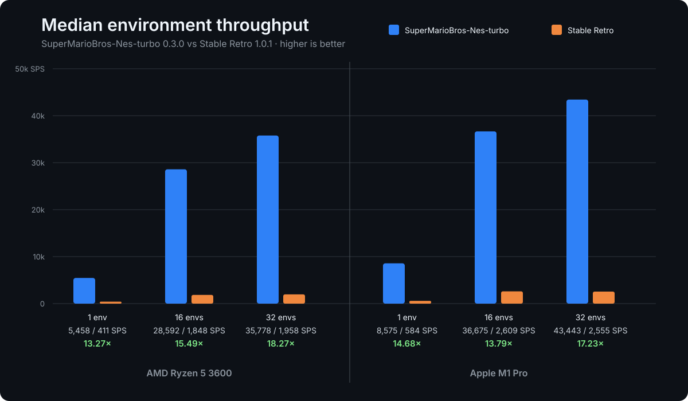
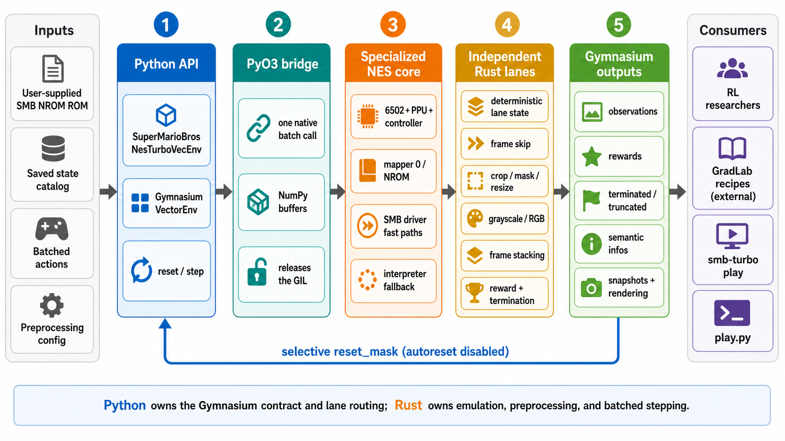

<div align="center">
  

  **🚀 Blazing fast SuperMarioBros-Nes environment for Reinforcement Learning 🍄**
</div>

<div align="center">
  
</div>

**SuperMarioBros-Nes-turbo** is a Rust-backed Gymnasium vector environment for
reinforcement-learning researchers working with Super Mario Bros NES. In the
published `0.3.0` mapper 0/NROM benchmark, it measured **13.27× to 18.27×** the
end-to-end step and preprocessing throughput of
[Stable Retro](https://github.com/Farama-Foundation/stable-retro), depending on
the host and number of environments.

## ⚡ Why it is fast

- **Focused scope.** It specializes in the canonical Super Mario Bros mapper
  0/NROM workload.
- **Native vector engine.** One Rust engine owns all lanes, releases the GIL,
  and parallelizes batches of four or more environments with Rayon.
- **One efficient call.** Actions, emulation, preprocessing, frame stacks,
  rewards, termination, and infos share reused buffers across one
  Python-to-Rust call.
- **Optimized rendering.** Guarded game-routine fast paths, event-bounded PPU
  stepping, and direct grayscale rendering avoid unnecessary interpreter and
  image work.

*Unsupported fast-path cases fall back to the instruction interpreter.*

## 📦 Install

Install the prebuilt package from PyPI:

```bash
python -m pip install supermariobrosnes-turbo
```

Prebuilt wheels support Python `>=3.9` on macOS, Linux, and Windows without a
Rust toolchain. See [CONTRIBUTING.md](CONTRIBUTING.md) for the source checkout
and development setup.

**ROM setup:** ROM files are not included. Set `RETRO_DATA_PATH` to a
user-writable data directory, then import the supported ROM from a file,
directory, or ZIP archive.

On macOS or Linux:

```bash
export RETRO_DATA_PATH="${XDG_DATA_HOME:-$HOME/.local/share}/retro"
smb-turbo import /path/to/roms
```

On Windows PowerShell:

```powershell
$env:RETRO_DATA_PATH = "$env:LOCALAPPDATA\retro"
smb-turbo import C:\path\to\roms
```

The importer writes
`<RETRO_DATA_PATH>/stable/SuperMarioBros-Nes-v0/rom.nes`. If the variable is
unset, it uses the equivalent data tree inside the installed package instead.
`rom_path=` and the CLI's `--rom` remain available as overrides. The canonical
ROM SHA-256 is:

```text
f61548fdf1670cffefcc4f0b7bdcdd9eaba0c226e3b74f8666071496988248de
```

## 🚀 Train with GradLab

Training recipes and implementations live in
[GradLab](https://github.com/tsilva/rlab), keeping this repository focused on
the environment. Run either published recipe from any directory by passing your
raw Super Mario Bros `.nes` file directly.

For a short PPO demonstration:

```bash
uvx gradlab@0.1.1 train SuperMarioBros-Nes-v0/Level1-1/turbo-demo --rom /absolute/path/to/SuperMarioBros.nes
```

For Go-Explore trajectory discovery, capped at 20 million transitions and
stopping locally on the first level completion:

```bash
uvx gradlab@0.1.1 train SuperMarioBros-Nes-v0/Level1-1/go-explore-20m --rom /absolute/path/to/SuperMarioBros.nes
```

GradLab verifies and uses the ROM in place, shows live progress, and writes a
playable `final_model.zip` below `./runs`. No GradLab installation, repository
checkout, credentials, or ROM registration is required. When training finishes
or is stopped safely, GradLab prints the matching version-pinned `uvx ... play`
command for that model.

The PPO demo runs 98,304 steps across 16 environments and is calibrated for
roughly two minutes on an M1 Pro; timing varies by hardware. The published
GradLab package currently targets macOS arm64 and Linux x86_64. A first
invocation may additionally download GradLab, Torch, and environment wheels.

## 🎮 Use

```python
import numpy as np

from supermariobrosnes_turbo import (
    Actions,
    SuperMarioBrosNesTurboVecEnv,
    action_batch,
)

env = SuperMarioBrosNesTurboVecEnv(
    "SuperMarioBros-Nes-v0",
    state="Level1-1",
    num_envs=16,
    use_restricted_actions="basic",
    frame_skip=4,
    obs_grayscale=True,
    obs_crop=(32, 0, 0, 0),
    obs_resize=(84, 84),
    obs_layout="chw",
    frame_stack=4,
)

observations, infos = env.reset(seed=123)
observations, rewards, terminated, truncated, infos = env.step(
    action_batch("right", env.num_envs)
)

done = terminated | truncated
if done.any():
    state_indices = np.full(env.num_envs, -1, dtype=np.int32)
    state_indices[done] = 0
    observations, reset_infos = env.reset(
        options={"reset_mask": done.copy(), "state_indices": state_indices},
    )
```

**Important:** Autoreset is disabled. Selectively reset terminal lanes before
stepping again.

## Turbo Vector API v1

`SuperMarioBrosNesTurboVecEnv` implements the strict Turbo Vector API v1:

- `metadata["turbo_api_version"]` is `1`, and `metadata["render_modes"]`
  advertises `rgb_array`.
- Immutable `capabilities` and `signal_schema` declarations describe supported
  features and the dtype, shape, and reset/step availability of every signal.
- `buttons`, `action_mode`, `action_preset`, `action_table`,
  `action_meanings`, and `action_table_hash` expose the resolved action
  semantics without provider-specific probing.
- `state_catalog` is an immutable ordered tuple. Callers select reset states
  with an `int32` `state_indices` array and inspect the read-only active indices
  with `active_state_indices()`; state sampling and lane routing remain
  caller-owned.
- `observation_ownership` and `observation_buffer_depth` declare the exact
  lifetime of returned observations. `render_lane(index)` renders one lane,
  `get_images()` renders all lanes, and `render()` renders lane zero.

Live positions can be captured without advancing emulation and restored into
any lane of the same environment:

```python
capture_mask = np.zeros(env.num_envs, dtype=np.bool_)
capture_mask[0] = True
captured = env.capture_snapshots(capture_mask)

restore_mask = np.zeros(env.num_envs, dtype=np.bool_)
restore_mask[3] = True
starts = [None] * env.num_envs
starts[3] = captured[0]
observations, infos = env.reset(
    options={"reset_mask": restore_mask, "snapshots": starts},
)
env.close()
```

Handles are reusable, session-local, and intentionally not pickleable. Snapshot
Codec API v1 explicitly converts them to versioned portable bytes and binds
decoded handles to a compatible destination environment:

```python
payloads = env.encode_snapshots(captured)
restored_handles = another_env.decode_snapshots(payloads)
observations, infos = another_env.reset(
    options={"reset_mask": capture_mask, "snapshots": restored_handles},
)
```

The immutable `snapshot_codec_metadata` declaration identifies
`supermariobrosnes-turbo.portable-v1` and its supported restore semantics. A
single masked reset can mix snapshot starts with ordinary `state_indices`;
`infos["start_source"]` distinguishes `"snapshot"` from `"environment"`.

## 🔬 Processed research infos

The original `INFO_KEYS` remain the default. Additional semantic game state is
opt-in, so the environment only decodes and returns the extra keys a caller
requests:

```python
from supermariobrosnes_turbo import AreaType, PlayerMotion

env = SuperMarioBrosNesTurboVecEnv(
    "SuperMarioBros-Nes-v0",
    state="Level1-1",
    info_filter={
        "mode": "all",
        "keys": [
            "x_pos",
            "y_pos",
            "area_type",
            "player_motion",
            "enemy_active",
            "enemy_x_pos",
        ],
    },
)
observations, infos = env.reset()
in_water = infos["area_type"] == AreaType.WATER
climbing = infos["player_motion"] == PlayerMotion.CLIMBING
```

`EXTRA_INFO_KEYS` lists the opt-in catalog and `AVAILABLE_INFO_KEYS` combines it
with the legacy keys. Explicit selections reject unknown names, remove
duplicates, and return only selected game-state keys in catalog order. The
`terminal` and `none` modes retain their existing meaning; reset lifecycle
metadata and Gymnasium `_key` masks are not game-state selections.

All selectable game-state variables are listed below in their canonical
`AVAILABLE_INFO_KEYS` order. Legacy variables are returned by default; extra
variables are returned only when explicitly named in `info_filter["keys"]`.

| Key | Set | Shape | NumPy dtype | Meaning |
| --- | --- | --- | --- | --- |
| `x_pos` | Legacy/default | `(num_envs,)` | `np.int_` | Combined horizontal world position. |
| `coins` | Legacy/default | `(num_envs,)` | `np.int_` | Legacy coin counter. |
| `levelHi` | Legacy/default | `(num_envs,)` | `np.int_` | Legacy world-number component. |
| `levelLo` | Legacy/default | `(num_envs,)` | `np.int_` | Legacy level-number component. |
| `lives` | Legacy/default | `(num_envs,)` | `np.int_` | Signed legacy life counter; `-1` signals game over. |
| `score` | Legacy/default | `(num_envs,)` | `np.int_` | Decoded decimal game score. |
| `scrolling` | Legacy/default | `(num_envs,)` | `np.int_` | Legacy horizontal-scrolling signal. |
| `time` | Legacy/default | `(num_envs,)` | `np.int_` | Decoded decimal level timer. |
| `xscrollHi` | Legacy/default | `(num_envs,)` | `np.int_` | High/page component of horizontal scroll. |
| `xscrollLo` | Legacy/default | `(num_envs,)` | `np.int_` | Low component of horizontal scroll. |
| `area_id` | Extra/opt-in | `(num_envs,)` | `np.int16` | Stable internal subarea identifier. |
| `area_pointer` | Extra/opt-in | `(num_envs,)` | `np.int16` | Current SMB area-data pointer, used to distinguish route destinations that reuse coordinates. |
| `area_type` | Extra/opt-in | `(num_envs,)` | `np.int8` | `AreaType`: `UNKNOWN=-1`, `WATER=0`, `GROUND=1`, `UNDERGROUND=2`, `CASTLE=3`. |
| `y_pos` | Extra/opt-in | `(num_envs,)` | `np.int32` | Combined world-space vertical position. |
| `y_screen_pos` | Extra/opt-in | `(num_envs,)` | `np.int16` | Screen-relative vertical position. |
| `player_motion` | Extra/opt-in | `(num_envs,)` | `np.int8` | `PlayerMotion`: `UNKNOWN=-1`, `GROUND=0`, `JUMPING_OR_SWIMMING=1`, `FALLING=2`, `CLIMBING=3`. |
| `player_power` | Extra/opt-in | `(num_envs,)` | `np.int8` | `PlayerPower`: `UNKNOWN=-1`, `SMALL=0`, `BIG=1`, `FIRE=2`. |
| `is_large` | Extra/opt-in | `(num_envs,)` | `np.bool_` | Normalized large-player hitbox/size state. |
| `x_velocity` | Extra/opt-in | `(num_envs,)` | `np.int16` | Sign-extended horizontal velocity in SMB velocity units. |
| `y_velocity` | Extra/opt-in | `(num_envs,)` | `np.int16` | Sign-extended vertical velocity in SMB velocity units. |
| `facing` | Extra/opt-in | `(num_envs,)` | `np.int8` | `Direction`: `LEFT=-1`, `NONE=0`, `RIGHT=1`. |
| `is_crouching` | Extra/opt-in | `(num_envs,)` | `np.bool_` | Normalized crouching state. |
| `is_swimming` | Extra/opt-in | `(num_envs,)` | `np.bool_` | Normalized swimming state. |
| `injury_timer` | Extra/opt-in | `(num_envs,)` | `np.int16` | Injury/invulnerability countdown in game-timer ticks. |
| `star_timer` | Extra/opt-in | `(num_envs,)` | `np.int16` | Star-power countdown in game-timer ticks. |
| `game_mode` | Extra/opt-in | `(num_envs,)` | `np.int8` | `GameMode`: `UNKNOWN=-1`, `TITLE=0`, `GAMEPLAY=1`, `VICTORY=2`, `GAME_OVER=3`. |
| `player_task` | Extra/opt-in | `(num_envs,)` | `np.int8` | `PlayerTask`: `UNKNOWN=-1`, `ENTRANCE_TIMER_SETUP=0`, `VINE_AUTO_CLIMB=1`, `VERTICAL_PIPE_ENTRY=2`, `SIDE_PIPE_ENTRY=3`, `FLAGPOLE_SLIDE=4`, `LEVEL_END=5`, `LOSE_LIFE=6`, `PLAYER_ENTRANCE=7`, `PLAYER_CONTROL=8`, `CHANGE_SIZE=9`, `INJURY_BLINK=10`, `PLAYER_DEATH=11`, `FIRE_FLOWER_TRANSFORM=12`. |
| `enemy_active` | Extra/opt-in | `(num_envs, 6)` | `np.bool_` | Normalized active mask for the six enemy/object slots. |
| `enemy_type_id` | Extra/opt-in | `(num_envs, 6)` | `np.int16` | Stable SMB object-category ID; inactive slots are `-1`. |
| `enemy_x_pos` | Extra/opt-in | `(num_envs, 6)` | `np.int32` | Combined horizontal world positions; inactive slots are `-1`. |
| `enemy_y_pos` | Extra/opt-in | `(num_envs, 6)` | `np.int32` | Combined vertical positions; inactive slots are `-1`. |
| `enemy_x_velocity` | Extra/opt-in | `(num_envs, 6)` | `np.int16` | Signed horizontal velocities; inactive slots are `0`. |
| `enemy_y_velocity` | Extra/opt-in | `(num_envs, 6)` | `np.int16` | Signed vertical velocities; inactive slots are `0`. |
| `enemy_facing` | Extra/opt-in | `(num_envs, 6)` | `np.int8` | Normalized `Direction`; inactive slots are `0` (`NONE`). |
| `loop_command_active` | Extra/opt-in | `(num_envs,)` | `np.bool_` | Whether SMB's castle loop command is active. |
| `loop_correct_count` | Extra/opt-in | `(num_envs,)` | `np.int16` | Number of accepted steps in the active castle-loop route. |
| `loop_pass_count` | Extra/opt-in | `(num_envs,)` | `np.int16` | Number of completed castle-loop passes. |

The environment may also add lifecycle metadata independently of the selected
game-state variables:

| Key | When present | Meaning |
| --- | --- | --- |
| `state_index` | Reset lanes | Active state-catalog index. |
| `start_source` | Reset lanes | Whether the lane started from the environment or a snapshot. |
| `terminated` | Terminated lanes | The lane reached a game terminal state. |
| `truncated` | Truncated lanes | The lane reached an external episode limit. |
| `_<key>` | With each emitted key | Gymnasium boolean mask identifying lanes for which that key is valid. |

Returned game-state arrays are owned copies and cannot be changed by later
environment steps. Unknown categorical engine values become `UNKNOWN = -1`.

Researchers who intentionally need unprocessed state can call `env.ram()` for
an immutable owned `(num_envs, 2048)` `uint8` snapshot. RAM addresses and byte
decoding are not part of the semantic `info` contract.

## 🏁 Play

```bash
smb-turbo play
```

Running `smb-turbo play` without a state starts from `Level1-1`; pass an exact
state identifier to start elsewhere. It plays manually unless a compatible
state-keyed action-run policy exists below `runs/`. As gameplay enters another
canonical level, playback automatically switches to that level's matching
policy when available.

Playback defaults to 30 FPS; pass `--fps max` (or its `--fpx max` alias) to run
without an explicit delay or renderer-vsync cap. Policy playback defaults to
`--view raw`, which displays RGB directly from its sole emulator without
grayscale conversion, cropping, resizing, max-pooling, or frame stacking;
`--view preprocessed` instead shows the transformed policy observation.

State names are exact identifiers from the configured state catalog. This
includes canonical names such as `Level1-1`, packaged variants such as
`Level2-1-clouds-easy`, and imported names such as `Custom`; shorthand and case
normalization are intentionally unsupported.

The checkout-compatible `uv run python play.py` entry point remains available.
For compatibility, playback still discovers historical algorithm-specific
action-run directories, preferring `runs/<State>-beam/` over
`runs/<State>-jerk/`. These positive-duration action-run policies require no
neural-network framework.

GradLab models use GradLab's interactive player instead. Each `uvx gradlab train`
command above prints the exact playback command for its newly trained model.

## 🧰 Commands

```bash
smb-turbo import /path/to/roms        # import the supported ROM
smb-turbo play                        # play Level1-1 manually or with its policy
uvx gradlab@0.1.1 train SuperMarioBros-Nes-v0/Level1-1/turbo-demo --rom /path/to/rom.nes
uvx gradlab@0.1.1 train SuperMarioBros-Nes-v0/Level1-1/go-explore-20m --rom /path/to/rom.nes
uv sync --frozen --extra dev --group dev  # install development dependencies
uv run maturin develop --release      # build the optimized Rust extension
make test                             # run Rust and Python tests
make test-retro-oracle                # run ROM-backed parity and policy tests
make benchmark                        # benchmark SuperMarioBros-Nes-turbo locally
make benchmark-report                 # compare SuperMarioBros-Nes-turbo with Stable Retro
uv run python scripts/benchmark_info_filter.py --rom /path/to/rom.nes  # diagnostic infos overhead
```

## 📈 Benchmark

[](BENCHMARKS.md)

The chart records the published `0.3.0` comparison. See
[BENCHMARKS.md](BENCHMARKS.md) for exact results, protocol, and machine details.
`benchmark_info_filter.py` is a paired diagnostic for the optional research-info
path only; its output is never eligible for autoresearch acceptance records.

## Notes

- **Scope:** This emulator supports only `SuperMarioBros-Nes-v0` on mapper
  0/NROM; it is not a general NES or Stable Retro replacement.
- **States:** Packaged states cover `Level1-1` through `Level8-4`, with
  additional variants. `state=` accepts one name, path, or byte payload;
  `state_catalog=` preloads an ordered selection for explicit per-lane resets.
- **Actions:** `Actions.ALL` and `Actions.FILTERED` accept per-button masks;
  `Actions.DISCRETE` provides Stable Retro-compatible 36-way actions and
  `Actions.MULTI_DISCRETE` exposes the three restricted button groups. Named
  metadata presets (`basic`, `standard`, `right-jump`, `basic-start`) and inline button
  tables such as `[[], ["RIGHT"], ["RIGHT", "A"]]` produce exact discrete
  spaces through `use_restricted_actions`.
- **Playback:** Play commands require a discoverable native SDL2 library and
  open local gameplay windows.
- **Contributing:** See [CONTRIBUTING.md](CONTRIBUTING.md) and follow the
  [Code of Conduct](CODE_OF_CONDUCT.md).
- **Affiliation:** This unofficial research project is not affiliated with or
  endorsed by Nintendo. See [NOTICE.md](NOTICE.md).

## Architecture



## License

Code is licensed under the [MIT License](LICENSE). Third-party names, marks, and
user-supplied content are excluded; see [NOTICE.md](NOTICE.md).
